# StreamFlow - Sequence Diagrams

This document contains up-to-date sequence diagrams for all flows in the StreamFlow WMS system.

---

## 1. Happy Path - Complete Order Flow (All Items Available)

```mermaid
sequenceDiagram
    autonumber
    
    actor Client
    participant OrderApi
    participant RabbitMQ as RabbitMQ<br/>(create-order-request)
    participant ERPApi
    participant ERPDb as ERP Database<br/>(SQLite + Outbox)
    participant OutboxWorker as MassTransit<br/>Outbox Publisher
    participant OrderCreatedTopic as RabbitMQ Topic<br/>(OrderCreated)
    participant InventoryService
    participant StockReservedTopic as RabbitMQ Topic<br/>(StockReserved)
    participant PickingService
    participant OrderPickedTopic as RabbitMQ Topic<br/>(OrderPicked)
    participant PackingService
    participant OrderPackedTopic as RabbitMQ Topic<br/>(OrderPacked)
    
    Note over Client,OrderPackedTopic: Phase 1: Order Creation (Request/Response Pattern)
    
    Client->>+OrderApi: POST /api/order
    OrderApi->>OrderApi: Generate CorrelationId = OrderId
    OrderApi->>+RabbitMQ: SendRequest(CreateOrderRequest)
    
    RabbitMQ->>+ERPApi: CreateOrderRequest
    ERPApi->>ERPApi: Validate Order (FluentValidation)
    
    ERPApi->>+ERPDb: BEGIN TRANSACTION
    ERPDb-->>-ERPApi: Transaction Started
    
    ERPApi->>ERPDb: INSERT Order + Items
    ERPDb-->>ERPApi: OrderNo Generated
    
    Note over ERPApi,ERPDb: Content Enricher Pattern:<br/>Add Items, Customer, Shipping Address
    
    ERPApi->>ERPDb: INSERT to Outbox Table<br/>(OrderCreated event + enriched data)
    ERPDb-->>ERPApi: Event Stored in Outbox
    
    ERPApi->>ERPDb: COMMIT TRANSACTION
    ERPDb-->>ERPApi: Committed
    
    ERPApi-->>RabbitMQ: CreateOrderResponse<br/>(OrderNo, Success=true)
    RabbitMQ-->>-OrderApi: Response Received
    OrderApi-->>-Client: 200 OK (OrderNo)
    
    Note over Client,OrderPackedTopic: Phase 2: Outbox Publishing & Inventory Check
    
    OutboxWorker->>ERPDb: Poll Outbox Table
    ERPDb-->>OutboxWorker: Unpublished Messages
    
    OutboxWorker->>+OrderCreatedTopic: Publish(OrderCreated)<br/>with enriched data
    OutboxWorker->>ERPDb: Mark as Published
    
    OrderCreatedTopic->>+InventoryService: OrderCreated Event
        
    InventoryService->>InventoryService: Check Stock Availability<br/>(80% success rate simulation)
    
    alt All Items Available
        InventoryService->>+StockReservedTopic: Publish(StockReserved)<br/>IsPartial=false, Items=All
        InventoryService->>InventoryService: Log: "All items available"
        
        Note over InventoryService,ERPApi: Phase 3: State Updates (Event-Driven)
        
        StockReservedTopic->>ERPApi: StockReserved Event
        ERPApi->>ERPDb: UPDATE Order<br/>State="StockReserved"<br/>All Items Status="Available"
        ERPApi->>ERPApi: Log with CorrelationId
        
        Note over StockReservedTopic,PickingService: Phase 4: Picking Process
        
        StockReservedTopic->>+PickingService: StockReserved Event<br/>(Priority Queue x-max-priority=10)
        
        Note over PickingService: Processing Time:<br/>Random 2000-5000ms
        
        PickingService->>PickingService: Simulate Picking Process<br/>Task.Delay(2000-5000ms)
        
        PickingService->>+OrderPickedTopic: Publish(OrderPicked)<br/>Set Priority Header (9 or 1)
        PickingService->>PickingService: Log: "Picking completed"<br/>with CorrelationId
        
        OrderPickedTopic->>ERPApi: OrderPicked Event
        ERPApi->>ERPDb: UPDATE Order<br/>State="Picked"<br/>Items Status="Picked"
        ERPApi->>ERPApi: Log with CorrelationId
        
        Note over OrderPickedTopic,PackingService: Phase 5: Packing Process
        
        OrderPickedTopic->>+PackingService: OrderPicked Event<br/>(PrefetchCount=16)
        
        Note over PackingService: Processing Time:<br/>Random 1500-3000ms
        
        PackingService->>PackingService: Simulate Packing Process<br/>Task.Delay(1500-3000ms)
        PackingService->>PackingService: Calculate Box Size & Weight
        
        PackingService->>+OrderPackedTopic: Publish(OrderPacked)<br/>BoxSize, Weight, Items
        PackingService->>PackingService: Log: "Packing completed"<br/>with CorrelationId
        
        OrderPackedTopic->>ERPApi: OrderPacked Event
        ERPApi->>ERPDb: UPDATE Order<br/>State="Packed" (FINAL)<br/>Items Status="Packed"
        ERPApi->>ERPApi: Log: "Order workflow complete"
        
        Note over Client,OrderPackedTopic: ✅ Order Complete: Created → StockReserved → Picked → Packed
    end
```

---

## 2. Partial Delivery Flow (Some Items Unavailable)

---

## 3. Validation Failure Flow (OrderInvalid)

```mermaid
sequenceDiagram
    autonumber
    
    participant Client
    participant OrderApi
    participant RabbitMQ as create-order-request<br/>Queue
    participant ERPApi
    participant OrderInvalidTopic as OrderInvalid<br/>Topic
    participant InvalidQueue as erp-invalid-order<br/>Queue
    
    Client->>+OrderApi: POST /api/order<br/>(Missing required fields)
    OrderApi->>+RabbitMQ: CreateOrderRequest
    
    RabbitMQ->>+ERPApi: CreateOrderRequest
    
    Note over ERPApi: FluentValidation Check
    
    ERPApi->>ERPApi: Validate Order:<br/>❌ Missing Customer<br/>❌ Missing Shipping Address<br/>❌ TotalAmount = 0
    
    ERPApi->>ERPApi: Collect Validation Errors
    
    ERPApi->>+OrderInvalidTopic: Publish(OrderInvalid)<br/>ValidationErrors[]<br/>OrderJson<br/>Reason="Validation failed"
    
    OrderInvalidTopic->>InvalidQueue: Route to Invalid Queue
    
    Note over InvalidQueue: Manual Review Required
    
    ERPApi-->>RabbitMQ: CreateOrderResponse<br/>IsSuccessful=false<br/>ErrorMessage="Validation failed: ..."
    
    RabbitMQ-->>-OrderApi: Response
    OrderApi-->>-Client: 200 OK<br/>(Success=false, Errors)
    
    Note over Client,InvalidQueue: ❌ Order Rejected: Stored in invalid-order queue for review
```

---

## 4. Complete Stock Unavailability Flow

---

## 5. Retry & Error Handling Flow

---

## 6. Concurrent Order Processing (Competing Consumers)

---

## 7. Priority Order Processing

```mermaid
sequenceDiagram
    autonumber
    
    participant Client
    participant OrderApi
    participant ERPApi
    participant OrderCreatedTopic as OrderCreated<br/>Topic
    participant InventoryService
    participant StockReservedTopic as StockReserved<br/>Topic
    participant PickingQueue as picking-stock-reserved<br/>Queue (Priority Enabled)
    participant PickingService
    participant OrderPickedTopic as OrderPicked<br/>Topic
    participant PackingService
    
    rect rgb(255, 255, 200)
        Note over Client,PackingService: Priority Order (Country="DK")
        
        Client->>+OrderApi: POST /api/order<br/>ShippingAddress.Country="DK"
        OrderApi->>+ERPApi: CreateOrderRequest
        
        ERPApi->>ERPApi: Detect Priority:<br/>Country="DK" → Priority=9<br/>OrderType="Priority"
        
        ERPApi->>OrderCreatedTopic: Publish(OrderCreated)<br/>Priority=9, Type="Priority"
        ERPApi-->>-OrderApi: Response
        OrderApi-->>-Client: 200 OK
        
        OrderCreatedTopic->>+InventoryService: OrderCreated (Priority=9)
        
        Note over InventoryService: Fast Processing:<br/>100ms delay (vs 500ms standard)
        
        InventoryService->>InventoryService: Check Stock (Fast Lane)
        InventoryService->>StockReservedTopic: Publish(StockReserved)<br/>OrderType="Priority"
        
        StockReservedTopic->>PickingQueue: Route to Priority Queue
        
        Note over PickingQueue: RabbitMQ Priority Queue<br/>x-max-priority=10<br/>Priority=9 orders jump ahead
        
        PickingQueue->>+PickingService: Fetch High Priority Message
        PickingService->>PickingService: Process Picking
        PickingService->>OrderPickedTopic: Publish(OrderPicked)<br/>Header: priority=9
        
        OrderPickedTopic->>+PackingService: OrderPicked (Priority=9)
        PackingService->>PackingService: Pack Order<br/>(PrefetchCount=16, parallel)
        PackingService->>PackingService: Complete
        
        Note over Client,PackingService: ✅ Priority Order: Faster processing at each stage
    end
    
    rect rgb(240, 240, 240)
        Note over Client,PackingService: Standard Order (Country="US")
        
        Client->>OrderApi: POST /api/order<br/>ShippingAddress.Country="US"
        OrderApi->>ERPApi: CreateOrderRequest
        
        ERPApi->>ERPApi: Detect Priority:<br/>Country!="DK" → Priority=1<br/>OrderType="Standard"
        
        ERPApi->>OrderCreatedTopic: Publish(OrderCreated)<br/>Priority=1, Type="Standard"
        
        OrderCreatedTopic->>InventoryService: OrderCreated (Priority=1)
        
        Note over InventoryService: Standard Processing:<br/>500ms delay
        
        InventoryService->>InventoryService: Check Stock (Normal Lane)
        InventoryService->>StockReservedTopic: Publish(StockReserved)<br/>OrderType="Standard"
        
        StockReservedTopic->>PickingQueue: Route to Priority Queue<br/>(but with lower priority)
        
        Note over PickingQueue: Standard order waits<br/>if priority orders exist
        
        PickingQueue->>PickingService: Fetch Standard Message<br/>(after priority orders)
        PickingService->>PickingService: Process Picking
        PickingService->>OrderPickedTopic: Publish(OrderPicked)<br/>Header: priority=1
        
        Note over Client,PackingService: Standard Order: Normal processing speed
    end
```

---

## 8. Transactional Outbox Pattern (Detailed)

```mermaid
sequenceDiagram
    autonumber
    
    participant Client
    participant ERPApi
    participant DbConnection as Database Connection
    participant OrdersTable as Orders Table
    participant OutboxTable as MassTransit<br/>OutboxMessage Table
    participant OutboxPublisher as MassTransit<br/>Outbox Background Worker
    participant RabbitMQ
    
    Client->>+ERPApi: CreateOrderRequest
    
    Note over ERPApi,OutboxTable: Atomic Transaction Boundary
    
    ERPApi->>+DbConnection: BEGIN TRANSACTION
    DbConnection-->>-ERPApi: Transaction Started
    
    rect rgb(230, 250, 230)
        Note over ERPApi,OutboxTable: Phase 1: Persist Order
        
        ERPApi->>+OrdersTable: INSERT INTO Orders<br/>(Id, OrderNo, CustomerId, State="Created")
        OrdersTable-->>-ERPApi: Order Saved (OrderNo=1001)
        
        ERPApi->>OrdersTable: INSERT INTO OrderItems<br/>(OrderId, Sku, Quantity, Status)
        
        Note over ERPApi,OutboxTable: Phase 2: Persist Event in Outbox
        
        ERPApi->>ERPApi: Build OrderCreated Event<br/>(Content Enricher Pattern)
        
        ERPApi->>+OutboxTable: INSERT INTO OutboxMessage<br/>MessageId=UUID<br/>Body=Serialized(OrderCreated)<br/>Destination="Contracts.Events:OrderCreated"<br/>SentAt=NULL<br/>EnqueueTime=UtcNow
        OutboxTable-->>-ERPApi: Event Stored
        
        Note over ERPApi: Both writes in same transaction<br/>Guarantee: Either both succeed or both fail
        
        ERPApi->>DbConnection: COMMIT TRANSACTION
        DbConnection-->>ERPApi: Transaction Committed ✅
    end
    
    ERPApi-->>-Client: CreateOrderResponse (Success)
    
    Note over OutboxPublisher,RabbitMQ: Phase 3: Async Publishing (Separate Process)
    
    loop Every 1 second (MassTransit Default)
        OutboxPublisher->>OutboxTable: SELECT * FROM OutboxMessage<br/>WHERE SentAt IS NULL<br/>ORDER BY EnqueueTime
        OutboxTable-->>OutboxPublisher: Unpublished Messages
        
        alt Messages Found
            OutboxPublisher->>OutboxPublisher: Deserialize Message Body
            
            OutboxPublisher->>+RabbitMQ: Publish to Exchange<br/>"Contracts.Events:OrderCreated"
            RabbitMQ-->>-OutboxPublisher: ACK
            
            Note over OutboxPublisher: Publishing Succeeded
            
            OutboxPublisher->>OutboxTable: UPDATE OutboxMessage<br/>SET SentAt=UtcNow<br/>WHERE MessageId=...
            
            Note over OutboxPublisher: Message marked as published
        else No Messages
            OutboxPublisher->>OutboxPublisher: Sleep 1 second
        end
    end
    
    Note over Client,RabbitMQ: ✅ Guaranteed Delivery:<br/>Order saved = Event will be published<br/>No lost messages, no orphaned events
```

---

## 9. Concurrency Control with RowVersion (Optimistic Locking)

```mermaid
sequenceDiagram
    autonumber
    
    participant StockReservedConsumer as StockReserved<br/>Consumer 1
    participant OrderPickedConsumer as OrderPicked<br/>Consumer 1 (concurrent)
    participant ERPDb as ERP Database
    
    Note over StockReservedConsumer,ERPDb: Scenario: Two events arrive simultaneously for same order
    
    par Concurrent Updates
        StockReservedConsumer->>+ERPDb: SELECT Order<br/>WHERE Id=OrderId<br/>RowVersion=1
        ERPDb-->>-StockReservedConsumer: Order (State="Created", RowVersion=1)
    and
        OrderPickedConsumer->>+ERPDb: SELECT Order<br/>WHERE Id=OrderId<br/>RowVersion=1
        ERPDb-->>-OrderPickedConsumer: Order (State="Created", RowVersion=1)
    end
    
    Note over StockReservedConsumer,OrderPickedConsumer: Both read RowVersion=1
    
    StockReservedConsumer->>StockReservedConsumer: Modify: State="StockReserved"<br/>Items.Status="Available"
    
    StockReservedConsumer->>+ERPDb: UPDATE Orders<br/>SET State="StockReserved", RowVersion=2<br/>WHERE Id=OrderId AND RowVersion=1
    ERPDb-->>-StockReservedConsumer: ✅ Success (1 row updated)<br/>RowVersion now = 2
    
    Note over StockReservedConsumer: Consumer 1 wins
    
    OrderPickedConsumer->>OrderPickedConsumer: Modify: State="Picked"<br/>Items.Status="Picked"
    
    OrderPickedConsumer->>+ERPDb: UPDATE Orders<br/>SET State="Picked", RowVersion=2<br/>WHERE Id=OrderId AND RowVersion=1
    ERPDb-->>-OrderPickedConsumer: ❌ DbUpdateConcurrencyException<br/>(0 rows updated, RowVersion changed)
    
    Note over OrderPickedConsumer: Retry Logic Triggered
    
    rect rgb(255, 250, 230)
        Note over OrderPickedConsumer: Retry Attempt 1
        
        OrderPickedConsumer->>+ERPDb: SELECT Order<br/>(Reload fresh data)
        ERPDb-->>-OrderPickedConsumer: Order (State="StockReserved", RowVersion=2)
        
        OrderPickedConsumer->>OrderPickedConsumer: Apply changes to fresh data:<br/>State="Picked"
        
        OrderPickedConsumer->>+ERPDb: UPDATE Orders<br/>SET State="Picked", RowVersion=3<br/>WHERE Id=OrderId AND RowVersion=2
        ERPDb-->>-OrderPickedConsumer: ✅ Success (1 row updated)<br/>RowVersion now = 3
    end
    
    Note over StockReservedConsumer,OrderPickedConsumer: ✅ Concurrency Conflict Resolved<br/>State transitions: Created → StockReserved → Picked
```

---

## Key Patterns & Technologies Implemented

### 🎯 **Enterprise Integration Patterns**
1. **Request-Response Pattern**: OrderApi ↔ ERPApi (MassTransit RequestClient)
2. **Publish-Subscribe Pattern**: All events use RabbitMQ topics
3. **Competing Consumers**: Multiple consumers per queue for scalability
4. **Content Enricher**: OrderCreated event includes all downstream data
5. **Dead Letter Channel**: Failed messages route to dead-letter queues
6. **Transactional Outbox**: Guarantees message delivery after DB commit
7. **Priority Queue**: Denmark orders get priority=9, fast-tracked through pipeline

### 🔄 **Reliability Mechanisms**
- **Retry Logic**: 3 attempts with 5-second intervals (exponential backoff available)
- **Optimistic Locking**: RowVersion prevents lost updates
- **SQLite WAL Mode**: Concurrent reads during writes
- **PrefetchCount Tuning**: 
  - ERPApi: `1` (SQLite single-writer limitation)
  - InventoryService: `16` (stateless, high throughput)
  - PickingService: `1` (priority queue ordering)
  - PackingService: `16` (parallel processing)

### 📊 **Observability**
- **CorrelationId**: Traced through all services
- **Structured Logging**: Serilog with Seq
- **Seq API Key**: All services authenticated
- **Service Enrichment**: Each log tagged with Service="ServiceName"

### 🔐 **Data Consistency**
- **ACID Transactions**: Order + Outbox saved atomically
- **Idempotency**: Events can be replayed safely (state transitions idempotent)
- **Event Sourcing-lite**: Order state derived from events

---

## Configuration Summary

| Service | PrefetchCount | Retry Policy | Priority Queue | Database |
|---------|--------------|--------------|----------------|----------|
| **ERPApi** | 1 | 3×5s | No | SQLite (WAL) |
| **InventoryService** | 16 | 3×5s | No | Stateless |
| **PickingService** | 1 | 3×5s | Yes (x-max-priority=10) | Stateless |
| **PackingService** | 16 | 3×5s | No | Stateless |

---

## Flow State Summary

| Flow | Initial State | Final State(s) | Event Sequence |
|------|--------------|----------------|----------------|
| **Happy Path** | Created | Packed | Created → StockReserved → Picked → Packed |
| **Partial Delivery** | Created | Packed | Created → PartialDelivered → Picked → Packed |
| **Stock Unavailable** | Created | StockUnavailable | Created → StockUnavailable (terminal) |
| **Validation Failure** | - | - | Rejected before creation (OrderInvalid event) |
| **Retry Success** | Created | Packed | Same as happy path (with retries) |
| **Fatal Error** | Any | DeadLetter | Moved to dead-letter queue after 3 retries |

---

**Generated**: November 7, 2025  
**System**: StreamFlow WMS - Event-Driven Microservices Architecture  
**Technology Stack**: .NET 8, MassTransit, RabbitMQ, SQLite, Serilog, Seq
