# StreamFlow - E-Commerce WMS System Architecture

## 📋 Overview

This document provides comprehensive Mermaid diagrams illustrating the **StreamFlow** warehouse management system architecture, message flows, and order processing pipeline.

---

## 🏗️ High-Level System Architecture


---

## 🔄 Complete Order Processing Flow

### Scenario 1: Full Stock Availability (Happy Path)

```mermaid
sequenceDiagram
    participant Client
    participant OrderApi
    participant RabbitMQ
    participant ERPApi
    participant Database
    participant Inventory
    participant Picking
    participant Packing

    Client->>OrderApi: POST /api/order (Order Data)
    activate OrderApi
    
    OrderApi->>RabbitMQ: CreateOrderRequest (Request/Reply)
    activate RabbitMQ
    
    RabbitMQ->>ERPApi: CreateOrderRequest
    activate ERPApi
    
    ERPApi->>Database: BEGIN TRANSACTION
    ERPApi->>Database: INSERT Order + OrderItems
    Note over ERPApi,Database: Status: "Created"<br/>OrderItems.Status: "Pending"
    
    ERPApi->>Database: INSERT Outbox (OrderCreated Event)
    ERPApi->>Database: COMMIT TRANSACTION
    
    ERPApi->>RabbitMQ: CreateOrderResponse (OrderNo, Success)
    deactivate ERPApi
    
    RabbitMQ->>OrderApi: CreateOrderResponse
    deactivate RabbitMQ
    
    OrderApi->>Client: 200 OK (OrderNo)
    deactivate OrderApi
    
    Note over ERPApi: Background Worker<br/>polls Outbox table
    
    ERPApi->>RabbitMQ: Publish OrderCreated Event<br/>(from Outbox)
    ERPApi->>Database: Mark Outbox message processed
    
    RabbitMQ->>Inventory: OrderCreated Event
    activate Inventory
    
    Note over Inventory: Random Check (80%)<br/>All items Available ✅
    Inventory->>Inventory: Simulate Check (100-500ms)
    
    Inventory->>RabbitMQ: Publish StockReserved Event
    deactivate Inventory
    
    RabbitMQ->>ERPApi: StockReserved Event
    activate ERPApi
    ERPApi->>Database: UPDATE Order.OrderState = "StockReserved"
    ERPApi->>Database: UPDATE OrderItems.Status = "Available"
    deactivate ERPApi
    
    RabbitMQ->>Picking: StockReserved Event<br/>(Priority Queue: 9 or 1)
    activate Picking
    
    Note over Picking: Pick items from warehouse
    Picking->>Picking: Simulate Picking (2-5s)
    
    Picking->>RabbitMQ: Publish OrderPicked Event<br/>(Priority Header)
    deactivate Picking
    
    RabbitMQ->>ERPApi: OrderPicked Event
    activate ERPApi
    ERPApi->>Database: UPDATE Order.OrderState = "Picked"
    ERPApi->>Database: UPDATE OrderItems.Status = "Picked"
    deactivate ERPApi
    
    RabbitMQ->>Packing: OrderPicked Event
    activate Packing
    
    Note over Packing: Pack items for shipping
    Packing->>Packing: Calculate Box Size & Weight
    Packing->>Packing: Simulate Packing (1.5-3s)
    
    Packing->>RabbitMQ: Publish OrderPacked Event<br/>(FINAL STATE)
    deactivate Packing
    
    RabbitMQ->>ERPApi: OrderPacked Event
    activate ERPApi
    ERPApi->>Database: UPDATE Order.OrderState = "Packed"
    ERPApi->>Database: UPDATE OrderItems.Status = "Packed"
    deactivate ERPApi
    
    Note over Database: Order Complete! ✅<br/>Ready for Shipping
```



---

### Scenario 2: No Stock Availability


---

### Scenario 3: Partial Stock Availability

```mermaid
sequenceDiagram
    participant Client
    participant OrderApi
    participant RabbitMQ
    participant ERPApi
    participant Database
    participant Inventory
    participant Picking
    participant Packing

    Client->>OrderApi: POST /api/order (Order Data)
    OrderApi->>RabbitMQ: CreateOrderRequest
    RabbitMQ->>ERPApi: CreateOrderRequest
    
    ERPApi->>Database: INSERT Order + OrderItems<br/>(Status: "Created", Items: "Pending")
    ERPApi->>Database: INSERT Outbox (OrderCreated)
    ERPApi->>RabbitMQ: CreateOrderResponse (Success)
    RabbitMQ->>OrderApi: CreateOrderResponse
    OrderApi->>Client: 200 OK (OrderNo)
    
    ERPApi->>RabbitMQ: Publish OrderCreated Event
    
    RabbitMQ->>Inventory: OrderCreated Event
    activate Inventory
    
    Note over Inventory: Random Check (80% per item)<br/>Item A: Available ✅<br/>Item B: Unavailable ❌<br/>Item C: Available ✅
    Inventory->>Inventory: Simulate Check (100-500ms)
    
    Inventory->>RabbitMQ: Publish PartialStockReserved Event<br/>(AvailableItems: [A, C]<br/>UnavailableItems: [B])
    deactivate Inventory
    
    RabbitMQ->>ERPApi: PartialStockReserved Event
    activate ERPApi
    ERPApi->>Database: UPDATE Order.OrderState = "PartialDelivered"
    ERPApi->>Database: UPDATE Item A.Status = "Available"
    ERPApi->>Database: UPDATE Item B.Status = "Unavailable"
    ERPApi->>Database: UPDATE Item C.Status = "Available"
    deactivate ERPApi
    
    RabbitMQ->>Picking: PartialStockReserved Event<br/>(Priority Queue)
    activate Picking
    
    Note over Picking: Pick ONLY Available Items [A, C]
    Picking->>Picking: Simulate Picking (2-5s)
    
    Picking->>RabbitMQ: Publish OrderPicked Event<br/>(Items: [A, C] only)
    deactivate Picking
    
    RabbitMQ->>ERPApi: OrderPicked Event
    activate ERPApi
    ERPApi->>Database: UPDATE Order.OrderState = "Picked"
    ERPApi->>Database: UPDATE Item A.Status = "Picked"
    ERPApi->>Database: UPDATE Item B.Status = "Unavailable" (unchanged)
    ERPApi->>Database: UPDATE Item C.Status = "Picked"
    deactivate ERPApi
    
    RabbitMQ->>Packing: OrderPicked Event
    activate Packing
    
    Note over Packing: Pack ONLY Available Items [A, C]
    Packing->>Packing: Simulate Packing (1.5-3s)
    
    Packing->>RabbitMQ: Publish OrderPacked Event<br/>(Items: [A, C] only)
    deactivate Packing
    
    RabbitMQ->>ERPApi: OrderPacked Event
    activate ERPApi
    ERPApi->>Database: UPDATE Order.OrderState = "Packed"
    ERPApi->>Database: UPDATE Item A.Status = "Packed"
    ERPApi->>Database: UPDATE Item B.Status = "Unavailable" (unchanged)
    ERPApi->>Database: UPDATE Item C.Status = "Packed"
    deactivate ERPApi
    
    Note over Database: Partial Order Complete! ⚠️<br/>Items A, C: Packed ✅<br/>Item B: Unavailable ❌
```



---

## 🎯 Service Responsibilities


---

## 📊 Database Schema


---

## 🔀 Event Flow by Type


---

## 🏃 Priority Queue System


---

## 🎨 Enterprise Integration Patterns Used


---

## 📈 Order State Transitions


---

## 🔍 OrderItem Status Lifecycle

```mermaid
stateDiagram-v2
    [*] --> Pending: Order Created
    
    Pending --> Available: Stock Check (Item In Stock)
    Pending --> Unavailable: Stock Check (Item Out of Stock)
    
    Available --> Picked: Picking Complete
    Available --> Unavailable: Stock Check Failed
    
    Picked --> Packed: Packing Complete
    
    Packed --> [*]: Item Shipped ✅
    Unavailable --> [*]: Item Not Fulfilled ❌
    
    note right of Pending
        Default state
        Awaiting inventory check
    end note
    
    note right of Available
        Item reserved
        Ready for picking
    end note
    
    note right of Unavailable
        Out of stock
        Not picked/packed
        Remains in this state
    end note
    
    note right of Picked
        Item picked from warehouse
        Ready for packing
    end note
    
    note right of Packed
        Item packed
        Ready for shipping
        Terminal success state
    end note
```



---

## 🛠️ Technology Stack


---

## 📋 API Endpoints

### OrderApi (API Gateway)
```http
POST /api/order
- Body: Order JSON
- Response: CreateOrderResponse (OrderNo, Success)
- Pattern: Request/Reply to ERPApi
```

### ERPApi (Order Management)
```http
POST /api/order
- Body: Order JSON
- Response: CreateOrderResponse (OrderNo, Success)
- Action: Create order + Outbox message

GET /api/order
- Response: List of all orders

GET /api/order/{id}
- Response: Order details by ID

GET /api/order/{state}
- Response: Orders by state (Created, Picked, Packed, etc.)

GET /api/order/{id}/tracking
- Response: OrderTrackingResponse with status history

PUT /api/order/{id}/state
- Body: New state (string)
- Response: 204 No Content
```

---

## 🔢 Configuration Values

### Priority Settings
- **Denmark Orders**: Priority = 9, OrderType = "Priority"
- **Other Countries**: Priority = 1, OrderType = "Standard"

### Processing Times
- **Inventory Check (Priority)**: 100ms
- **Inventory Check (Standard)**: 500ms
- **Picking Time**: 2000-5000ms (random)
- **Packing Time**: 1500-3000ms (random)

### Inventory Availability
- **Item Availability Rate**: 80% per item
- **Full Stock**: ~80% of orders (all items available)
- **Partial Stock**: ~20% of orders (some items unavailable)
- **No Stock**: <1% of orders (all items unavailable)

### Queue Settings
- **Max Priority**: 10
- **Priority Queue Prefetch**: 4
- **Retry Attempts**: 3
- **Retry Interval**: 5 seconds

### Database
- **OrderNo Starting Value**: 1000
- **Auto-Increment**: Yes
- **Unique Index**: OrderNo

---

## 🎯 Key Features

1. ✅ **Transactional Outbox Pattern**: Ensures reliable event publishing
2. ✅ **Content Enricher Pattern**: Eliminates HTTP calls between services
3. ✅ **Priority Queue System**: Fast-tracks Denmark orders
4. ✅ **Random Inventory Logic**: 80% availability simulation
5. ✅ **Partial Order Fulfillment**: Processes available items separately
6. ✅ **Item-Level Status Tracking**: Granular fulfillment visibility
7. ✅ **Event-Driven Architecture**: Loose coupling, high scalability
8. ✅ **Request/Reply Gateway**: Synchronous client response
9. ✅ **Dead Letter Queue**: Handles failed messages
10. ✅ **Retry Mechanism**: Automatic retry on failures

---

## 🚀 Message Flow Summary


---

## 📚 Related Documentation

- **Item Status Tracking**: `ORDERITEM_STATUS_TRACKING.md`
- **Random Inventory Logic**: `INVENTORY_RANDOM_STOCK_IMPLEMENTATION.md`
- **Database Migrations**: `DATABASE_MIGRATION_STATUS.md`
- **NET 9 Downgrade**: `NET9_DOWNGRADE_FIXES.md`
- **Code Cleanup Report**: `UNUSED_CODE_CLEANUP_REPORT.md`

---

## 🎉 Summary

**StreamFlow** is a modern, event-driven warehouse management system built with:
- **.NET 9** for high performance
- **RabbitMQ + MassTransit** for reliable messaging
- **SQLite + EF Core** for data persistence
- **Enterprise Integration Patterns** for scalable architecture
- **Microservices** for modularity and maintainability

The system handles **full, partial, and no-stock scenarios** with **priority queue processing** for critical orders, **transactional messaging** for reliability, and **comprehensive tracking** for complete visibility.

**Ready for production deployment!** 🚀
