# StreamFlow EIP Architecture - Mermaid Diagram

## Main Flow Diagram

## Content Enricher Pattern (ERPApi)

```mermaid
graph TB
    classDef input fill:#dae8fc,stroke:#6c8ebf,stroke-width:2px
    classDef process fill:#e1d5e7,stroke:#9673a6,stroke-width:2px
    classDef output fill:#d5e8d4,stroke:#82b366,stroke-width:2px

    Input[Minimal Order<br/>OrderNo: 1001<br/>CustomerId: 123]:::input
    
    Enrich[ERPApi Content Enricher]:::process
    
    Input --> Enrich
    
    Enrich --> DB1[Fetch Customer Details]
    Enrich --> DB2[Fetch Order Items]
    Enrich --> DB3[Calculate Shipping Address]
    Enrich --> DB4[Determine Priority]
    
    DB1 --> Output
    DB2 --> Output
    DB3 --> Output
    DB4 --> Output
    
    Output[Enriched OrderCreated Event<br/>✓ Customer Name, Email<br/>✓ Full Item Details<br/>✓ Shipping Address<br/>✓ Priority Level<br/>✓ Payment Info]:::output
```

## Content-Based Router Pattern (InventoryService)

## Dead Letter Channel Pattern

## Transactional Outbox Pattern (ERPApi)

## Correlation Identifier Pattern

## Complete System Overview with Error Handling

```mermaid
graph TB
    classDef endpoint fill:#d5e8d4,stroke:#82b366,stroke-width:2px
    classDef queue fill:#fff2cc,stroke:#d6b656,stroke-width:2px
    classDef priorityQueue fill:#ffe6cc,stroke:#d79b00,stroke-width:3px
    classDef enricher fill:#e1d5e7,stroke:#9673a6,stroke-width:2px
    classDef router fill:#dae8fc,stroke:#6c8ebf,stroke-width:2px
    classDef dlc fill:#f8cecc,stroke:#b85450,stroke-width:2px
    classDef broker fill:#fff2cc,stroke:#d6b656,stroke-width:4px

    Client[External Client]
    OrderApi[OrderApi]:::endpoint
    ERPApi[ERPApi<br/>Content Enricher]:::enricher
    ERPGateway[ERPGateway<br/>Outbox Relay]:::enricher
    RabbitMQ[RabbitMQ Broker]:::broker
    
    %% Inventory Branch
    InventoryQueue[inventory-check]:::queue
    InventoryService[InventoryService<br/>Router]:::router
    InventoryDLC[inventory-DLC]:::dlc
    
    %% Picking Branch
    PickingQueue[picking-stock-reserved<br/>Priority Queue]:::priorityQueue
    PickingService[PickingService<br/>Translator]:::endpoint
    PickingDLC[picking-DLC]:::dlc
    
    %% Packing Branch
    PackingQueue[packing-order-picked]:::queue
    PackingService[PackingService]:::endpoint
    PackingDLC[packing-DLC]:::dlc
    
    Complete[✅ Complete]:::endpoint
    
    %% Main Flow
    Client --> OrderApi
    OrderApi --> ERPApi
    ERPApi --> ERPGateway
    ERPGateway --> RabbitMQ
    
    %% Inventory Flow
    RabbitMQ --> InventoryQueue
    InventoryQueue --> InventoryService
    InventoryService -->|Success| RabbitMQ
    InventoryService -.->|3 Retries Failed| InventoryDLC
    
    %% Picking Flow
    RabbitMQ --> PickingQueue
    PickingQueue --> PickingService
    PickingService -->|Success| RabbitMQ
    PickingService -.->|3 Retries Failed| PickingDLC
    
    %% Packing Flow
    RabbitMQ --> PackingQueue
    PackingQueue --> PackingService
    PackingService -->|Success| Complete
    PackingService -.->|3 Retries Failed| PackingDLC
```

## Priority Queue Visualization

```mermaid
graph TB
    classDef high fill:#ff6b6b,stroke:#c92a2a,stroke-width:3px
    classDef medium fill:#ffa94d,stroke:#fd7e14,stroke-width:2px
    classDef low fill:#51cf66,stroke:#2f9e44,stroke-width:2px

    subgraph "picking-stock-reserved Priority Queue"
        direction TB
        High[Priority 10<br/>🔥 DK Orders<br/>OrderType = DK<br/>Priority = 9]:::high
        Medium[Priority 5<br/>⚡ Standard Express]:::medium
        Low[Priority 1<br/>📦 Regular Orders]:::low
        
        High --> |Processed First| PickingService[PickingService Consumer]
        Medium --> |Processed Second| PickingService
        Low --> |Processed Last| PickingService
    end
```

## Message Flow Sequence

## Health Checks Architecture

```mermaid
graph TB
    classDef service fill:#d5e8d4,stroke:#82b366,stroke-width:2px
    classDef check fill:#dae8fc,stroke:#6c8ebf,stroke-width:2px
    classDef healthy fill:#51cf66,stroke:#2f9e44,stroke-width:2px
    classDef unhealthy fill:#ff6b6b,stroke:#c92a2a,stroke-width:2px

    subgraph "InventoryService Health Checks"
        InventoryService[InventoryService]:::service
        InventoryService --> DBCheck1[Database Health]:::check
        InventoryService --> RabbitCheck1[RabbitMQ Health]:::check
        
        DBCheck1 --> |Connected| Healthy1[✅ Healthy]:::healthy
        DBCheck1 --> |Failed| Unhealthy1[❌ Unhealthy]:::unhealthy
        
        RabbitCheck1 --> |Connected| Healthy2[✅ Healthy]:::healthy
        RabbitCheck1 --> |Failed| Unhealthy2[❌ Unhealthy]:::unhealthy
    end
    
    subgraph "PickingService Health Checks"
        PickingService[PickingService]:::service
        PickingService --> RabbitCheck2[RabbitMQ Health]:::check
        
        RabbitCheck2 --> |Connected| Healthy3[✅ Healthy]:::healthy
        RabbitCheck2 --> |Failed| Unhealthy3[❌ Unhealthy]:::unhealthy
    end
    
    subgraph "PackingService Health Checks"
        PackingService[PackingService]:::service
        PackingService --> RabbitCheck3[RabbitMQ Health]:::check
        
        RabbitCheck3 --> |Connected| Healthy4[✅ Healthy]:::healthy
        RabbitCheck3 --> |Failed| Unhealthy4[❌ Unhealthy]:::unhealthy
    end
```

---

## How to Use These Diagrams

### In GitHub/GitLab
Mermaid diagrams render automatically in markdown files on GitHub and GitLab. Just view this file!

### In VS Code
1. Install extension: **Markdown Preview Mermaid Support**
2. Open this file
3. Press `Ctrl+Shift+V` to preview

### Export to Image
1. Copy diagram code
2. Go to: https://mermaid.live/
3. Paste code
4. Click "Export" → PNG/SVG/PDF

### In Documentation Sites
Most documentation generators (Docusaurus, MkDocs, VuePress) support Mermaid natively.

### In Draw.io
1. Go to: https://mermaid.live/
2. Paste diagram code
3. Export as SVG
4. Import SVG into Draw.io

---

## EIP Patterns Legend

| Pattern | Service | Implementation |
|---------|---------|----------------|
| 📨 Content Enricher | ERPApi | Enriches OrderCreated with customer, items, address, priority |
| 🔀 Content-Based Router | InventoryService | Routes by Priority (9) and OrderType (DK) for fast-tracking |
| 🔄 Message Translator | PickingService | Transforms StockReserved → OrderPicked |
| 💾 Transactional Outbox | ERPApi + ERPGateway | Guarantees message delivery with DB transaction |
| ☠️ Dead Letter Channel | All Services | 3 retries with 5s delay, then DLC for manual review |
| 🔢 Priority Queue | picking-stock-reserved | x-max-priority: 10, DK orders get priority 10 |
| 🔗 Correlation Identifier | All Services | End-to-end tracing with CorrelationId |
| 🏢 Message Broker | RabbitMQ | Central messaging hub |
| ➡️ Point-to-Point Channel | All Queues | Direct queue-to-consumer communication |
| 🔄 Polling Consumer | ERPGateway | Polls Outbox table every 5s |
| 📍 Message Endpoint | OrderApi, Services | Message entry/exit points |

---

## Technology Stack

- **.NET 10.0** - Framework
- **MassTransit 8.5.4** - Messaging abstraction
- **RabbitMQ** - Message broker
- **Entity Framework Core** - ORM
- **SQLite** - Database
- **Serilog** - Structured logging
- **ASP.NET Core Health Checks** - Monitoring

---

## Quick Stats

- **Services**: 5 (OrderApi, ERPApi, InventoryService, PickingService, PackingService)
- **Worker Services**: 3 (Inventory, Picking, Packing)
- **Message Queues**: 6 (3 main + 3 DLC)
- **EIP Patterns**: 11 implemented
- **Events**: 4 (OrderCreated, StockReserved, OrderPicked, OrderPacked)
- **Consumers**: 6 (3 main + 3 fault)
- **Retry Attempts**: 3 per message
- **Retry Delay**: 5 seconds
- **Priority Levels**: 1-10 (Priority Queue)
- **Health Checks**: DB + RabbitMQ per service
