# StreamFlow WMS - Sequence Diagrams

## Success Scenario - Complete Order Flow

## Exception Handling Scenarios

```mermaid
sequenceDiagram
    autonumber
    actor Client
    participant OrderAPI
    participant RabbitMQ as RabbitMQ<br/>(Message Broker)
    participant ERPAPI
    participant OrderDB as Order DB
    participant Service as Any Service<br/>(Inventory/Picking/Packing)
    participant DLC as Dead Letter<br/>Channel (DLC)
    participant FaultConsumer as Fault<br/>Consumer

    rect rgb(255, 240, 245)
        Note over Client,ERPAPI: Scenario 1: Business Validation Error (No Retry)
        Client->>+OrderAPI: POST /api/order<br/>(Invalid customer)
        OrderAPI->>+RabbitMQ: CreateOrderRequest
        RabbitMQ->>+ERPAPI: Consume request
        ERPAPI->>ERPAPI: Validation fails<br/>(Customer not found)
        ERPAPI->>-RabbitMQ: Reply CreateOrderResponse<br/>(Error: Customer not found)
        RabbitMQ-->>-OrderAPI: Error response
        OrderAPI-->>-Client: 500 Internal Server Error<br/>(Error message)
        Note over ERPAPI: ❌ No retry - Business error
    end

    rect rgb(255, 250, 240)
        Note over Client,OrderDB: Scenario 2: Transient Database Error (Retry with Exponential Backoff)
        Client->>+OrderAPI: POST /api/order
        OrderAPI->>+RabbitMQ: CreateOrderRequest
        RabbitMQ->>+ERPAPI: Consume request (Attempt 1)
        ERPAPI->>+OrderDB: Save Order
        OrderDB-->>-ERPAPI: ❌ DbUpdateException<br/>(Deadlock)
        ERPAPI->>ERPAPI: Throw exception<br/>(triggers retry)
        
        Note over RabbitMQ,ERPAPI: Retry Policy: 3 attempts, exponential backoff
        
        RabbitMQ->>ERPAPI: Retry Attempt 2<br/>(after 1s delay)
        ERPAPI->>+OrderDB: Save Order
        OrderDB-->>-ERPAPI: ✅ Success
        ERPAPI->>-RabbitMQ: Reply CreateOrderResponse<br/>(Success)
        RabbitMQ-->>-OrderAPI: Success response
        OrderAPI-->>-Client: 200 OK
        Note over ERPAPI: ✅ Recovered via retry
    end

    rect rgb(255, 240, 240)
        Note over Service,FaultConsumer: Scenario 3: Exhausted Retries → Dead Letter Channel
        RabbitMQ->>+Service: Consume StockReserved (Attempt 1)
        Service->>Service: Processing fails<br/>(Exception thrown)
        Service-->>-RabbitMQ: ❌ Nack (retry)
        
        RabbitMQ->>+Service: Retry Attempt 2<br/>(after delay)
        Service->>Service: Still fails
        Service-->>-RabbitMQ: ❌ Nack (retry)
        
        RabbitMQ->>+Service: Retry Attempt 3<br/>(final attempt)
        Service->>Service: Still fails
        Service-->>-RabbitMQ: ❌ Nack (exhausted)
        
        Note over RabbitMQ,DLC: After max retries, message → Dead Letter Queue
        
        RabbitMQ->>+DLC: Move to Dead Letter Queue<br/>(picking-dead-letter)
        DLC->>+FaultConsumer: Consume Fault<T>
        FaultConsumer->>+OrderDB: Store fault in Outbox<br/>(RetryCount=999, ProcessedAt=null)
        OrderDB-->>-FaultConsumer: Stored for investigation
        FaultConsumer->>FaultConsumer: Log critical error<br/>(Alert operations team)
        FaultConsumer-->>-DLC: Ack
        
        Note over FaultConsumer: 💀 Manual investigation required<br/>Message stored for replay
    end

    rect rgb(240, 255, 255)
        Note over Client,ERPAPI: Scenario 4: Stock Unavailable (Graceful Degradation)
        Client->>+OrderAPI: POST /api/order
        OrderAPI->>RabbitMQ: CreateOrderRequest
        RabbitMQ->>ERPAPI: Process & store order
        ERPAPI->>RabbitMQ: OrderCreated event
        RabbitMQ->>Service: Check inventory
        
        Service->>Service: All items out of stock<br/>(Availability check)
        Service->>+RabbitMQ: Publish StockUnavailable<br/>(No retry needed)
        RabbitMQ->>+ERPAPI: Consume StockUnavailable
        ERPAPI->>+OrderDB: Update Order<br/>(State: StockUnavailable)<br/>Mark all items: Unavailable
        OrderDB-->>-ERPAPI: Updated
        ERPAPI-->>-RabbitMQ: Ack
        
        Note over Client,ERPAPI: ❌ Order ends gracefully<br/>Customer notified via tracking API
    end

    rect rgb(250, 240, 255)
        Note over Client,ERPAPI: Scenario 5: Partial Stock Availability
        Client->>+OrderAPI: POST /api/order<br/>(3 items)
        OrderAPI->>RabbitMQ: CreateOrderRequest
        RabbitMQ->>ERPAPI: Process order
        ERPAPI->>RabbitMQ: OrderCreated event
        RabbitMQ->>Service: Check inventory
        
        Service->>Service: 2 items available<br/>1 item unavailable
        Service->>+RabbitMQ: Publish StockReserved<br/>(IsPartialReservation=true)<br/>(TotalReserved=2, TotalRequested=3)
        
        RabbitMQ->>+ERPAPI: Consume StockReserved
        ERPAPI->>+OrderDB: Update Order<br/>(State: PartialDelivered)<br/>2 items: Available<br/>1 item: Unavailable
        OrderDB-->>-ERPAPI: Updated
        
        Note over Service,ERPAPI: ⚠️ Flow continues with available items<br/>Customer receives partial fulfillment
        
        RabbitMQ->>Service: Continue to Picking (2 items)
        Service->>RabbitMQ: OrderPicked (2 items)
        RabbitMQ->>Service: Continue to Packing (2 items)
        Service->>RabbitMQ: OrderPacked (2 items)
        RabbitMQ->>ERPAPI: Update final state
        ERPAPI->>OrderDB: State: Packed<br/>2 items: Packed<br/>1 item: Unavailable
        
        Note over Client,ERPAPI: ⚠️ Partial success<br/>Customer notified via tracking
    end
```

## Error Handling Strategy Summary

### 1. **Request/Reply Pattern** (OrderAPI ↔ ERPAPI)
- **Transient errors** (DB deadlock, connection timeout): 
  - ✅ Throw exception → MassTransit retries 3 times with exponential backoff
  - If all retries fail → Message moves to `erp-dead-letter`
- **Business errors** (validation, not found):
  - ❌ Reply with error response → No retry (client receives error immediately)

### 2. **Event-Driven Pattern** (All services)
- **Transient errors**: Automatic retry with exponential backoff (up to 3 attempts)
- **After retry exhaustion**: Message moves to service-specific Dead Letter Queue
  - `inventory-dead-letter`
  - `picking-dead-letter`
  - `packing-dead-letter`

### 3. **Dead Letter Channel (DLC) Handling**
- All dead letter queues consumed by `FaultConsumer<T>`
- Faulted messages stored in `Outbox` table with `RetryCount=999`
- Operations team alerted for manual investigation
- Messages can be replayed after fixing root cause

### 4. **Transactional Outbox Pattern**
- Ensures **at-least-once delivery** guarantee
- Order and events saved in same DB transaction (ACID)
- Background worker publishes events asynchronously
- Prevents message loss even if RabbitMQ is down

### 5. **Graceful Degradation**
- **Stock unavailable**: Order marked as failed, no retry needed
- **Partial availability**: Order continues with available items, customer notified

## Key Patterns Used
1. **Request/Reply** - Synchronous communication with response
2. **Transactional Outbox** - Reliable event publishing
3. **Content-Based Router** - Route based on stock availability
4. **Content Enricher** - Events carry full order context (no HTTP calls)
5. **Priority Queue** - Priority orders processed first (`x-max-priority=10`)
6. **Dead Letter Channel** - Failed message handling
7. **Competing Consumers** - Multiple service instances can process messages
8. **Idempotent Consumer** - Safe message reprocessing
